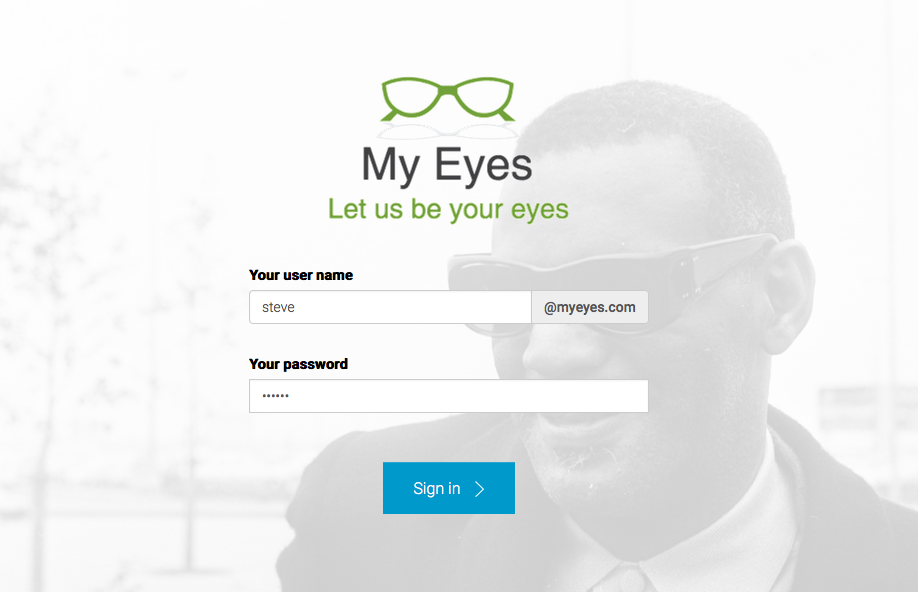
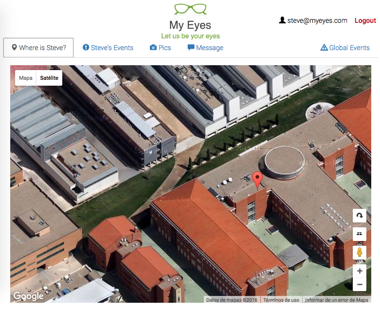
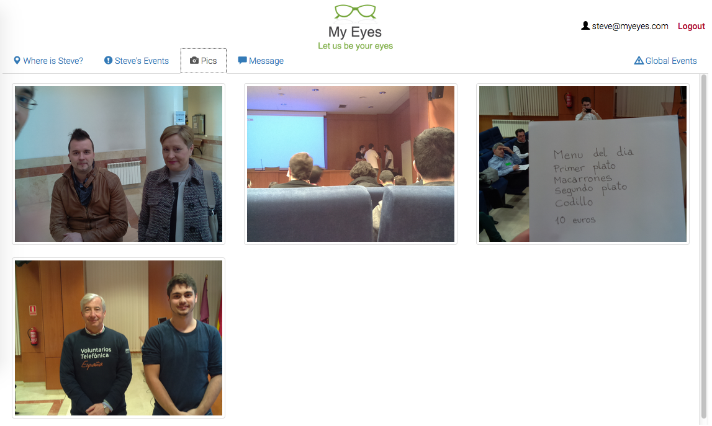

# myeyes-ui

Página web de gestión del proyecto [MyEyes](https://github.com/unblind/unblind-doc).

## Capturas de pantalla

**Acceso a la aplicación**

**Ubicación de las gafas**

**Fotos tomadas por las gafas**

